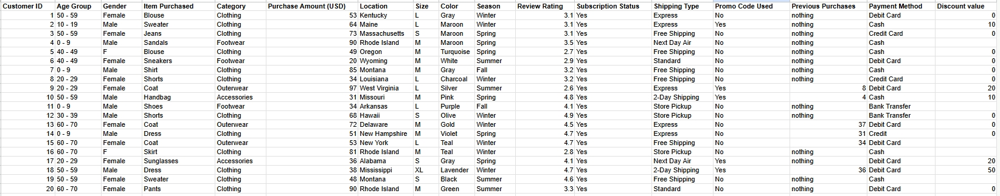
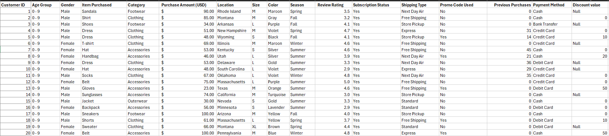
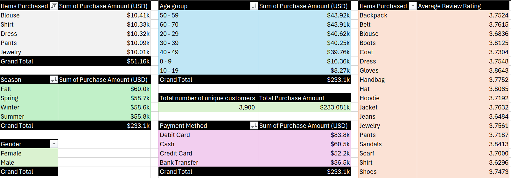
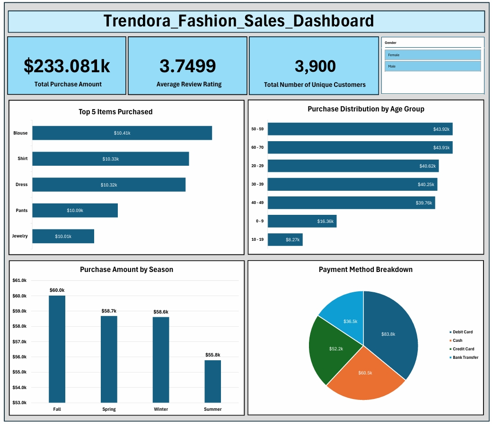

# Trendora Fashion Sales Performance Report 

## Executive Summary
This report analyzes Trendora Fashion's sales performance by examining customer purchasing behaviour, seasonal trends, product performance, and payment preferences. The findings provide actionable insights to support strategic decision-making and improve overall business performance. 

## Business Context
Trendora Shopping’s management requires clear reporting of their sales performance at the transaction level. The objective is to understand performance of the business and Customer behaviour in order to support business decisions and optimize operations.

## Objectives
This report addresses the following key questions:
- What are the Key Performance Indicators (KPIs), and how do they measure overall business performance? 
- Which items are most preferred and what’s the best- performing sales season? 
- What are the preferred payment methods for customers?

## Data Overview
The analysis is based on a sample dataset of 3900 purchases and 17 columns. It represents the purchases and transaction details of customers across seasons.  

## Data Preview 

## Data Cleaning and Transformation
- Checked & removed duplicate entries from the entire dataset. 
- Formatted and Standardized the Gender and Previous Purchase column to ensure consistency. 
- Changed the data types of each column to the most appropriate ones for seamless operations. 
- Used the fill down to replace approximately 195 null values from the Gender column. 
- Corrected inconsistent spellings in the Payment Method column. 
- Missing values in the Discount Value column were retained as null because there was no valid replacement . 

## Data Summarization (Pivot Table)

## Key Findings
- The Total revenue from all purchases is $233.081k.
- The total sales gotten from female customers is $175.317k whilst a total of $57.764k is gotten from male customers indicating an opportunity to produce strategies for more male customer engagement. 
- Items in the Clothing category generated the highest number of purchases than other categories making it the primary contributor to overall sales. 
- The most preferred payment method is Debit card as it is the most frequently used compared to Bank Transfer which is the least preferred method. 

## Dashboard 

## Detailed Findings & Analysis

### Key Performance Indicators 
- The Total revenue from all purchases is $233.081k.
- There is a total of 3,900 unique customers, with females being 2,956 and males being 944. 
- The total sales gotten from female customers is $175.317k whilst a total of $57.764k is gotten from male customers indicating that female customers currently contribute the majority of revenue. 
- Compared to the highest rating of 5.0, the overall average review rating is 3.7499 indicating room for improvement in customer satisfaction.  

### Top 5 purchased Items 
- The item ‘Blouse’ is the highest selling item but has an average review rating below the overall average of 3.7499; suggesting that while customers are purchasing the product, they may be dissatisfied with its quality, design or overall experience.
- Four out of the top 5 purchased items are from the clothing category showing the need for continuous restock of these items. 

### Purchase Distribution by Age Group 
- The pattern displayed shows that a higher amount of purchase is gotten from the older customers; specifically from those in their 50s up to the 70s. 
- Female Customers aged 50 - 59 make up the majority of blouse purchases with rating below overall average; hence, an investigation should go on to find the cause of their dissatisfaction. 
- Male customers aged 40-49 generated the highest purchase amount among male age groups.  

### Purchase Amount by Season
- The Fall season generated the most sales. 
- Compared to the Female gender, the Male gender purchased more items during the Winter Season than during Fall. 
Overall, there is minimal variation between these seasons except when compared by gender.

### Payment method Breakdown
- Customer payment preferences vary widely: Debit Card (36%), Cash (26%), Credit Card (22%), Bank Transfer (16%) declaring Debit card as the most preferred. 
- This pattern remains when compared by gender.  

## Recommendations
- Increase inventory levels ahead of the Fall season to meet higher customer demand and prevent stock shortages. 
- The low rating of the most purchased item highlights the need for a change in blouse styles, design, quality and to ensure customers get accurate sizing before delivery or pick up.
- Introduce promotions for the items in Footwear & Out wear categories during Winter season, as they underperform compared to others.
- Collect customer feedback through surveys to better understand the reasons behind lower product ratings and identify opportunities for improvement. 

## Tools Used
**Excel**: Data cleaning, transformation, analysis and visualization

## Conclusion
The analysis shows that Trendora Fashion performed strongly in terms of sales, with Clothing products and the Fall season contributing most to overall revenue. However, the average customer rating indicates room for improvement, particularly for high-demand products like blouses. By improving product quality, optimizing seasonal inventory, and strengthening promotions for underperforming categories, the business can enhance customer satisfaction and drive future growth.

